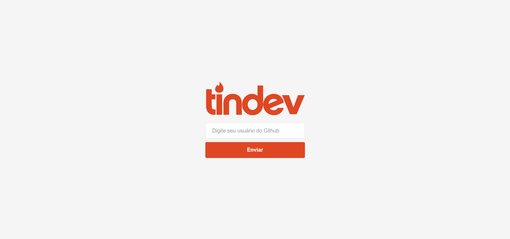
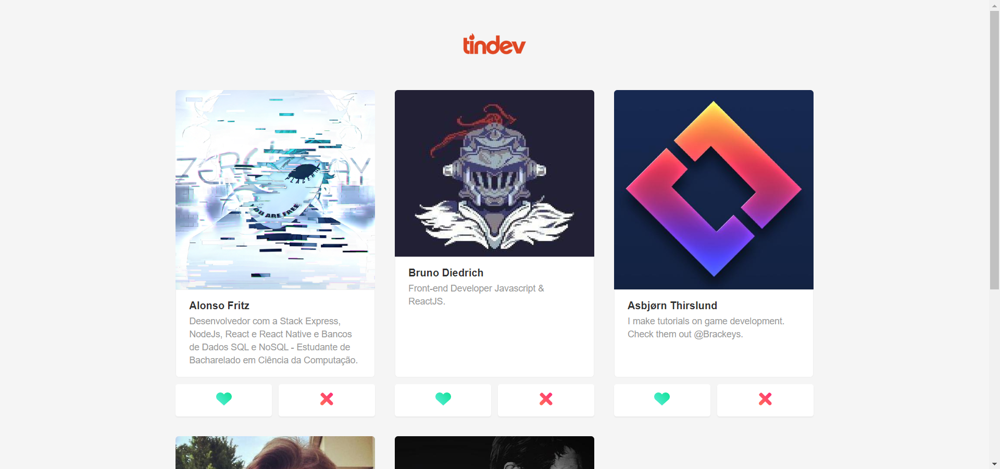
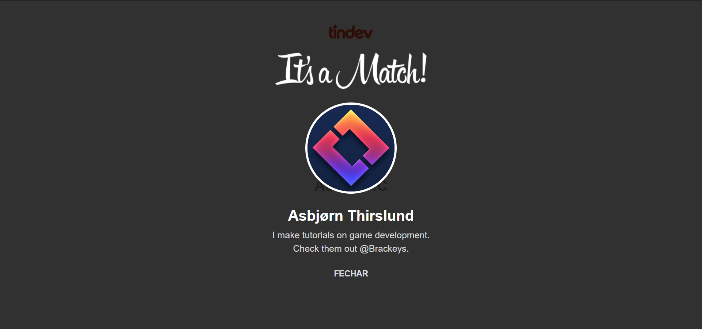
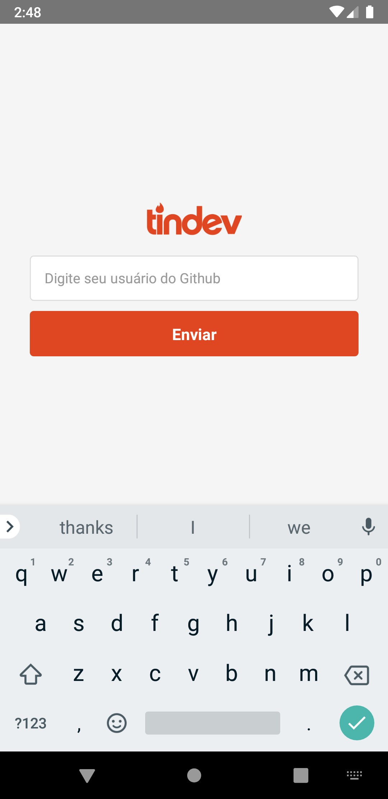
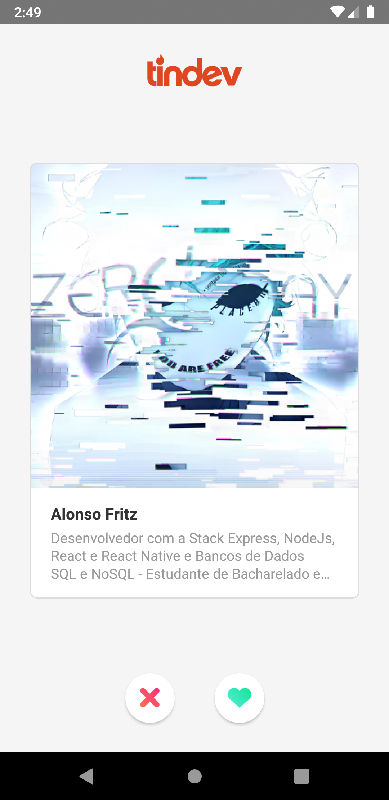

# Índice

- [Sobre](#sobre)
- [Tecnologias Utilizadas](#tecnologias-utilizadas)
- [Resultados](#resultados)
- [Como Usar](#como-usar)

<a id="sobre"></a>

## Sobre

O <strong>Tindev</strong> é um monorepo de uma aplicação clone do Tinder com versão Web e Mobile integrada a API do Github para encontrar e facilitar o contato entre Desenvolvedores, com o objetivo de auxiliar no Networwing dos usuários.

Essa aplicação foi construída na <strong>Semana Omnistack 8.0</strong> distribuída pela [Rocketseat](https://rocketseat.com.br/).

## Tecnologias Utilizadas

- [Javascript](https://www.javascript.com/)
- [Node.js](https://nodejs.org/en/)
- [ReactJS](https://reactjs.org/)
- [React Native](https://reactnative.dev/)
- [MongoDB](https://www.mongodb.com/)

## Resultados

### Resultado WEB:

<h1 align="center">
    
    
    
</h1>

### Resultado MOBILE:

<h1 align="center">
    
    
</h1>

## Como usar

- ### **Pré-requisitos**

  - É necessário possuir o **[Node.js](https://nodejs.org/en/)** instalado na máquina;
  - E também ter um gerenciador de pacotes seja o **[NPM](https://www.npmjs.com/)** ou **[Yarn](https://yarnpkg.com/)**;

1. Clonando o Projeto :

```sh
  $ git clone https://github.com/alonsofritz/tindev.git
```

2. Executando a Aplicação:

```sh
  # Instale as dependências
  $ yarn

  # Inicie a API
  $ cd backend
  $ yarn dev

  ## Insira a URL do MongoDB no arquivo server.js Linha 22 [SUA URL DO MONGODB AQUI]

  # Inicie a aplicação web
  $ cd frontend
  $ yarn start

  # Inicie a aplicação mobile
  $ cd tindev
  $ yarn start
```
Nota: Se você optar por iniciar o aplicativo móvel no emulador Android, será necessário iniciar o emulador antes de usar o comando `yarn start`.

## Ministrado por:

**[Diego Fernandes](https://github.com/diego3g)** para a **Omnistack 08**.

## License

Esse projeto está sob a licença MIT. Veja o arquivo [LICENSE](LICENSE.md) para mais detalhes.

</br>
</br>

<p align="center">
  <a href="https://rocketseat.com.br">
    
  </a>
  <a>
  
</p>

---
<h4 align="center">
    :rocket: Feito por <a href="https://www.linkedin.com/in/alonsofritz/" target="_blank">Alonso Fritz</a>
</h4>